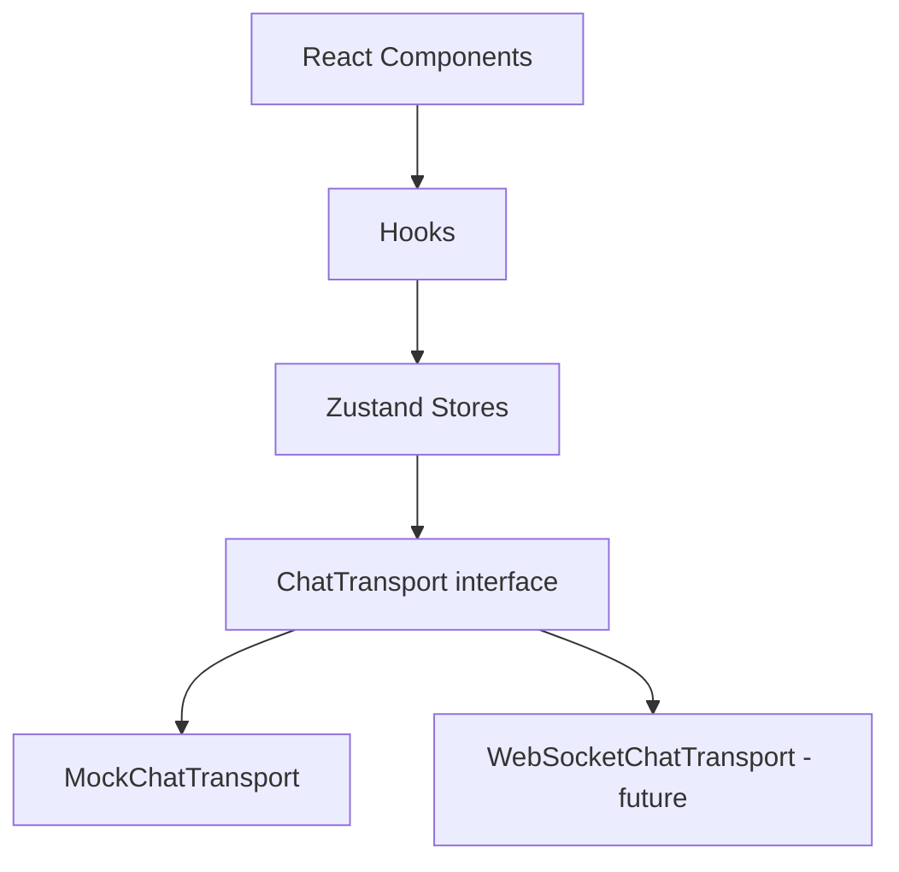
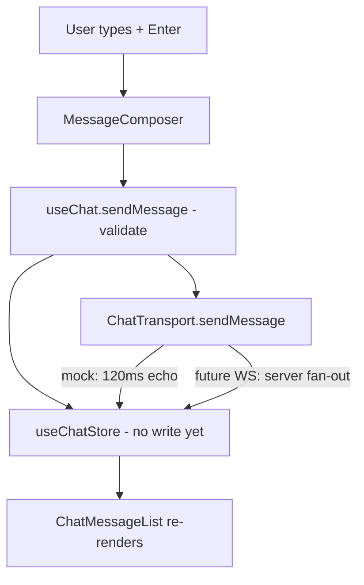

# Temp Chat — ephemeral chat rooms

A modern temporary chat-room web app. Create a room, share a link, talk, and
leave nothing behind: no accounts, no history, no database.

> **Local-preview honesty note.** This release ships with an in-memory
> `MockChatTransport`. It renders the full message flow in one browser tab but
> **cannot synchronize independent browsers** — that needs the future
> WebSocket backend. The UI says so too (a banner in every room). Nothing in
> this README describes the mock as real networking.

---

## 1. Product

### What it does

Temp Chat lets any two (or more) people talk for a while without signing up
for anything:

1. **Create** — one click generates a random 6-character room code
   (e.g. `X7K29P`) and opens `/room/X7K29P`.
2. **Share** — the creator copies an invite link (`…/room/X7K29P`).
3. **Join** — anyone with the link picks a temporary display name and enters.
4. **Talk** — messages and a presence roster appear live; connection state is
   always visible.
5. **Leave** — leaving clears that room's messages and participants from the
   device. When everyone leaves, nothing remains anywhere.

### Who it is for

People who need a quick conversation channel: a study group, a support
session, a game lobby, a meeting backchannel — anywhere a permanent Slack /
Discord / Teams space would be overkill.

### What "temporary" means, concretely

| Data               | Where it lives                  | Lifetime              |
| ------------------ | ------------------------------- | --------------------- |
| Messages           | In-memory Zustand store         | Until you leave/close |
| Participants       | In-memory Zustand store         | Until you leave/close |
| Display name + tab | `sessionStorage` (tab-scoped)   | Until the tab closes  |
| Room itself        | Nowhere — the URL *is* the room | —                     |
| Server copy        | Does not exist                  | —                     |

Closing the tab, leaving the room, or reloading wipes messages. The name is
kept per-tab only so navigation and reloads don't force re-typing; it is never
sent to a server (there is no server).

---

## 2. Features

- **Create room** — cryptographically random 6-char code (Crockford alphabet,
  no confusable `I/L/O/0/1`), generated in the browser.
- **Join room** — code validation (empty / malformed codes get inline errors),
  then navigation to `/room/:roomId`.
- **Temporary display name** — required before entering; validated
  (1–24 chars); no account of any kind.
- **Live messages** — send with Enter, `Shift+Enter` for new lines,
  auto-growing composer, 1000-char limit with live counter, inline errors.
- **Presence roster** — participant list with avatars, "You" badge, mute
  indicators; count badge in the header.
- **Connection status** — `Idle / Connecting… / Connected / Reconnecting… /
  Disconnected / Error`, as text plus a dot (never color alone), announced via
  `role="status"`. Browser offline/online events are honored.
- **Share** — copies the invite link (clipboard API with execCommand fallback)
  with success/failure toasts, plus a room-info dialog (code, occupancy,
  "saved anywhere: never").
- **Leave** — confirmation dialog that states the ephemerality promise;
  leaving disconnects, clears the room's messages + participants, and returns
  home.
- **Responsive** — sidebar roster on desktop, bottom-sheet roster on mobile;
  composer always reachable.
- **Dark mode** — class-based toggle persisted as a UI preference.
- **Media readiness (UI only)** — mic/camera toggles update local presence;
  voice/video/screen-share buttons are disabled with tooltips explaining that
  a signaling server is still needed. No fake calls.
- **Toasts** — Sonner for copy/share/media feedback.
- **Empty/invalid states** — no-messages empty state, nobody-here roster,
  invalid-link page, connection-error banner, name gate for deep links.

---

## 3. Technology stack

| Technology                    | Version | Why it exists                                                    |
| ----------------------------- | ------- | ---------------------------------------------------------------- |
| React                         | 19.3    | UI rendering, components, hooks.                                 |
| TypeScript                    | 6.0     | Strict static types for models, stores, transport.               |
| Vite                          | 8.3     | Dev server + production bundler.                                 |
| Tailwind CSS                  | 4.3     | Utility-first styling (CSS-based config, no config file needed). |
| shadcn-style primitives       | —       | Accessible UI primitives (Radix-based) owned in `src/components/ui`. |
| Radix UI                      | 1.x     | Headless accessible dialog, tooltip, avatar, scroll, separator.  |
| Zustand                       | 5.0     | Shared app state (identity, room, chat, participants, media).    |
| React Router                  | 7.18    | `/` and `/room/:roomId` routing.                                 |
| Lucide React                  | 1.47    | Icons (no emoji, consistent set).                                |
| Sonner                        | 2.0     | Toast notifications.                                             |
| class-variance-authority      | 0.7     | Component variants (button, badge, alert).                       |
| clsx + tailwind-merge         | —       | `cn()` class-name helper.                                        |
| Vitest + Testing Library      | 5.0/16  | Unit + component tests in jsdom.                                 |
| ESLint (flat)                 | 10.11   | Linting incl. react-hooks and react-refresh rules.               |

Why each choice was made — including rejected alternatives — is documented in
`developer-guide.md`.

---

## 4. Architecture

Strict one-way layering. Each layer only talks to the one below it:



- **Components** render and handle input. No networking, no store writes
  outside their hooks' callbacks.
- **Hooks** (`useRoom`, `useChat`, `useParticipantsView`, `useMediaSession`)
  own side effects: transport subscriptions, connect/disconnect, clipboard.
- **Stores** hold plain state + pure transitions. They never import transports.
- **Services** implement networking behind `ChatTransport`. Only the
  `getChatTransport()` factory knows which implementation exists.

Media mirrors this: components → `useMediaSession` → `useMediaStore` →
`MediaSession` (currently an honest "unavailable" placeholder).

### Performance posture (from the Vercel React best-practices skill v1.0.0)

- Zustand **selectors per concern** (`useMessages`, `useParticipantCount`) so
  the header badge never re-renders the message list.
- `ChatMessage` is **memoized**; lists cap at 200 messages/room and use
  `content-visibility: auto`.
- Room route is **lazy-loaded** (`React.lazy`) so the landing page stays light
  (landing ≈ 387 KB, room chunk ≈ 65 KB).
- No barrel files; no components defined inside components; state derived
  during render; functional `setState` in stores.
- See `developer-guide.md` § "Vercel best practices" for the full mapping.

---

## 5. Data flow

Sending a message today (mock) vs. tomorrow (WebSocket):



Key point: `useChat` and the stores call identical transport methods in both
worlds. Swapping `getChatTransport()` to return `WebSocketChatTransport` (plus
a server URL) changes no component, hook, or store.

**Mock behavior, precisely:** `connect()` waits ~350 ms, emits `connected` +
a `join` presence event for yourself; `sendMessage()` echoes your message back
after ~120 ms; everything is per-tab. Open a second browser and it knows
nothing about the first — by design, until a server exists.

**Future production behavior:** the documented `WebSocketChatTransport`
speaks JSON frames (`join` / `message` / `leave` → `message` / `presence`).
The server would own ids, timestamps, and fan-out.

---

## 6. Directory structure

```text
src/
├── app/            App shell: App.tsx (providers), routes.tsx (lazy RoomPage)
├── pages/          HomePage, RoomPage (+ HomePage tests)
├── components/
│   ├── ui/         shadcn-style primitives: button, input, textarea, avatar,
│   │               badge, dialog, sheet, separator, tooltip, scroll-area,
│   │               alert, sonner
│   ├── chat/       ChatHeader, ChatMessage, ChatMessageList, MessageComposer,
│   │               ParticipantList, ConnectionStatus
│   ├── room/       CreateRoomForm, JoinRoomForm, DisplayNameInput,
│   │               RoomShareButton, RoomInfo
│   ├── media/      CallControls (honest future UI)
│   └── ThemeToggle.tsx
├── hooks/          useRoom, useChat, useParticipants, useMediaSession
├── stores/         useIdentityStore, useRoomStore, useChatStore,
│                   useParticipantStore, useMediaStore (+ tests)
├── services/
│   ├── chat/       ChatTransport, MockChatTransport, WebSocketChatTransport,
│   │               transport (factory)
│   └── media/      MediaSession (service access point)
├── types/          chat, room, media (models + MediaSession interface)
├── lib/            utils (cn), room (codes), user (identity), message (+ tests)
├── test/           vitest setup (jest-dom, cleanup)
├── main.tsx        entry point
└── index.css       Tailwind v4 + design tokens + dark variant
```

---

## 7. File-by-file documentation

### `src/main.tsx`
Purpose: React entry point. Renders `<App/>` in `StrictMode`. Depends on
`app/App` and `index.css`. Nothing else belongs here.

### `src/app/App.tsx`
Purpose: provider composition — `BrowserRouter`, tooltip provider, Sonner
`Toaster`. No pages, no state. Depends on `routes` + ui primitives.

### `src/app/routes.tsx`
Purpose: route table (`/`, `/room/:roomId`, fallback). Lazy-loads `RoomPage`
so the landing bundle stays small. Components must not import this; only
`App` uses it.

### `src/pages/HomePage.tsx`
Purpose: landing page. Owns the shared display-name draft, renders create /
join sections, product promises, footer honesty note. Depends on room forms,
`useIdentityStore`, `ThemeToggle`. Must not contain room logic.

### `src/pages/RoomPage.tsx`
Purpose: `/room/:roomId` screen. Validates the code (invalid → error page),
gates on display name (`NameGate`), wires `useRoom`/`useChat`/
`useParticipantsView`, lays out header/sidebar/chat/sheet/composer. Depends on
hooks + chat/room/media components. Must not touch transports directly.

### `src/components/chat/ChatHeader.tsx`
Purpose: room top bar — code, participant-count badge, `ConnectionStatus`,
share, leave (with confirm dialog), mobile roster button. Emits callbacks
only. Must not navigate or copy links itself.

### `src/components/chat/ChatMessage.tsx`
Purpose: memoized single message. Renders sender, `<time dateTime>`, and
**plain-text** content (XSS-safe by construction). Must never use
`dangerouslySetInnerHTML`.

### `src/components/chat/ChatMessageList.tsx`
Purpose: scrollable `role="log"` list with bottom-stick autoscroll (pauses
while reading history) and a no-messages empty state. Depends only on
`ChatMessage`.

### `src/components/chat/MessageComposer.tsx`
Purpose: auto-growing textarea, Enter-to-send, length counter, inline errors.
Calls `onSend` and displays its error string. Must not validate beyond
delegating (validation lives in `lib/message` + hook).

### `src/components/chat/ParticipantList.tsx`
Purpose: presence roster with avatars, "You" badge, mute text labels, empty
state. Pure render of props. Must not subscribe to stores directly (keeps it
reusable/testable).

### `src/components/chat/ConnectionStatus.tsx`
Purpose: `role="status"` connection indicator — text plus dot. Must always
include text (never color-only).

### `src/components/room/CreateRoomForm.tsx` / `JoinRoomForm.tsx`
Purpose: validated create/join flows ending in `navigate(/room/…)`. They set
identity then navigate. Must not generate UI beyond their section.

### `src/components/room/DisplayNameInput.tsx`
Purpose: shared labeled name field with error slot. Used by both forms and
the room gate. Validation messages come from callers.

### `src/components/room/RoomShareButton.tsx` / `RoomInfo.tsx`
Purpose: invite-link copying with toasts; read-only room facts dialog.
Copy logic coordination lives in `useRoom.shareRoom`; the button only reports
the boolean result. Must not build URLs themselves (button) — `RoomInfo`
receives data as props.

### `src/components/media/CallControls.tsx`
Purpose: mic/camera toggles (local presence state) + disabled call buttons
with "needs signaling server" tooltips + media-error alert. Must not claim
calling works.

### `src/components/ThemeToggle.tsx`
Purpose: light/dark class toggle. A UI preference, unrelated to chat state.

### `src/components/ui/*`
Purpose: owned UI primitives in the shadcn pattern (Radix behavior + app
styling via `cn()`). `button, input, textarea, avatar, badge, dialog, sheet,
separator, tooltip (+Hint helper), scroll-area, alert, sonner`. Add styling
variants here; never rebuild these behaviors ad hoc elsewhere.

### `src/hooks/useRoom.ts`
Purpose: room lifecycle — transport subscribe/connect/disconnect, join/leave
state, online/offline handling, `shareRoom` clipboard, `leave` cleanup +
navigation. The only place that calls `transport.connect/disconnect` for the
page. Stores must not import this (direction is hook → store).

### `src/hooks/useChat.ts`
Purpose: `useMessages` selector + validated `sendMessage` returning an error
string or null. No subscriptions (those live in `useRoom`).

### `src/hooks/useParticipants.ts`
Purpose: `useParticipantsView` — list + derived count selectors. Read-only.

### `src/hooks/useMediaSession.ts`
Purpose: media actions over `useMediaStore` + `MediaSession`; converts
"unavailable" rejections into surfaced errors. No real WebRTC calls.

### `src/stores/useIdentityStore.ts`
Purpose: ephemeral `{id, displayName}` with tab-scoped `sessionStorage`
(versioned key, try/catch). Actions: `setDisplayName`, `clear`.

### `src/stores/useRoomStore.ts`
Purpose: current `room`, `connection`, `error`; `joinRoom/setConnection/
setError/leaveRoom`. Selectors: `useRoomId`, `useConnection`.

### `src/stores/useChatStore.ts`
Purpose: `messagesByRoom` capped at 200/room, dedupe by id, per-room clear.
Selector `useMessages` with a shared empty reference.

### `src/stores/useParticipantStore.ts`
Purpose: `participantsByRoom` with upsert/remove/media-update/clear.
Selectors `useParticipants`, `useParticipantCount` (count subscribed
separately for header performance).

### `src/stores/useMediaStore.ts`
Purpose: local mic/camera/share/call-state + error + reset. Frontend-only by
design; documented as such.

### `src/services/chat/ChatTransport.ts`
Purpose: the `ChatTransport` interface (connect/disconnect/send/subscribe).
The seam that makes the backend swappable. Must stay framework-free.

### `src/services/chat/MockChatTransport.ts`
Purpose: in-memory implementation with simulated latency. For UI dev and
tests only. Must never be imported by components/hooks (only via factory and
its own test).

### `src/services/chat/WebSocketChatTransport.ts`
Purpose: future JSON-protocol WebSocket client (currently unwired). Documents
the wire protocol in its header comment. Must not be instantiated until a
server URL is configured.

### `src/services/chat/transport.ts`
Purpose: `getChatTransport()` singleton factory (+ `setChatTransport` test
hatch). The only file allowed to choose an implementation.

### `src/services/media/MediaSession.ts`
Purpose: `getMediaSession()` access point (currently the unavailable
placeholder). Future WebRTC plugs in here.

### `src/types/chat.ts` / `room.ts` / `media.ts`
Purpose: `ChatMessage`, `ConnectionState`, transport event types; `Room`,
`Participant`, `TempUser`; `CallState`, `MediaSessionError`,
`MediaSession` interface + `createUnavailableMediaSession`. Types and tiny
factories only — no React, no I/O.

### `src/lib/room.ts` / `user.ts` / `message.ts` / `utils.ts`
Purpose: room-code generate/normalize/validate; display-name + temp-id
helpers; message validation + time formatting; `cn()`. Pure functions with
unit tests. No components, no stores.

---

## 8. Zustand

**Why Zustand:** a tiny external store with selector subscriptions — components
re-render only when their slice changes, without provider trees or boilerplate.
`useRoomStore(s => s.connection)` subscribes to one field; Context would
re-render every consumer on any change.

**Responsibilities:** identity (who am I this tab), room (where + how
connected), chat (messages by room), participants (presence by room), media
(local call UI state). Five focused stores, not one giant object, so each can
change shape independently and components subscribe narrowly.

**Selectors:** shared `EMPTY_*` references avoid fresh-array re-renders;
`useParticipantCount` derives a number so the header badge ignores list churn;
`messageCount` is selected separately from `messages`.

**Not in Zustand:** composer drafts, dialog open states, form errors (local
`useState`); anything derivable during render.

## 9. shadcn/ui

This project uses the shadcn pattern: accessible primitives (built on Radix)
**owned in `src/components/ui`** and composed at the app level — not a
traditional install-and-import component library. Benefits: full style control
via our Tailwind tokens, tree-shaken per-file imports, Radix accessibility
(focus traps, ARIA, keyboard) for free. Only the primitives actually used were
added (button, input, textarea, avatar, badge, dialog, sheet, separator,
tooltip, scroll-area, alert, sonner); dropdown-menu and card were deliberately
skipped — no use case yet, and plain elements cover those spots.

## 10. Networking

**Why frontend-only can't sync browsers:** tabs (let alone devices) share no
memory. Only a server relaying events between sockets can do that. An
in-memory object literally cannot reach another browser.

**What the mock does:** simulates latency and echoes your own messages so the
whole pipeline (validate → send → receive → render) is real code, just
looped back. Presence emits your own join.

**Adding WebSocket later:** implement/configure the server for the protocol
documented in `WebSocketChatTransport.ts`, return that transport from
`getChatTransport()` (e.g. when `VITE_WS_URL` is set), delete nothing else.
Room ids stay client-generated; the server should still re-validate them and
own message ids/timestamps.

## 11. WebRTC

WebRTC carries peer-to-peer audio/video/data with low latency — ideal for
calls — but peers still need **signaling** (exchanging SDP offers/answers and
ICE candidates, usually over WebSocket), plus **STUN** (discover public
address) and **TURN** (relay when peer-to-peer is blocked). Multi-user rooms
generally need an **SFU** (selective forwarding unit like LiveKit/Janus) so
each client sends one stream instead of N.

Current preparation: `MediaSession` interface, `useMediaStore` + presence
media flags, `CallControls` UI with honest disabled states, permission-error
taxonomy (`MediaSessionError`). No `getUserMedia`/`RTCPeerConnection` code
exists yet — and the UI says so.

## 12. No database

Deliberate. The product promise is ephemerality: nothing to breach, nothing
to moderate retroactively, nothing to pay to host. Messages live in a capped
in-memory map; identity in tab sessionStorage; both vanish. Adding persistence
would contradict the product, not improve it.

## 13. Security limitations

- Messages are **untrusted input**: rendered as text only, length-checked,
  never injected as HTML.
- Room codes are validated client-side; with no server there is **no
  authorization** — anyone with the link can join, names are spoofable, and a
  future server must re-validate everything.
- No secrets exist in this codebase; none may be added to frontend code.
- Transport is currently loopback; when WebSocket lands it needs `wss://`,
  origin checks, and rate limiting server-side.

## 14. Development

Prerequisites: Node 24+, npm 11+, Git.

```bash
npm install      # install dependencies
npm run dev      # start dev server (http://localhost:5173)
npm run build    # typecheck + production build to dist/
npm run typecheck# TypeScript project references, no emit
npm run lint     # ESLint, zero warnings allowed
npm run test     # Vitest run (32 tests)
npm run test:watch # Vitest watch mode
npm run preview  # serve the production build locally
```

No environment variables are required. `.env.example` reserves `VITE_WS_URL`
for the future transport.

## 15. Troubleshooting

| Problem | Cause / fix |
| ------- | ----------- |
| `npm: command not found` in PowerShell / execution-policy error | Use `cmd /c "npm …"` or `npm.cmd`; or `Set-ExecutionPolicy -Scope CurrentUser RemoteSigned`. |
| Port 5173 busy | `npm run dev -- --port 5174`. |
| Blank page at `/room/XYZ` | Invalid code → app shows the invalid-link page by design; use a 6-char code. |
| Name gate keeps showing | Identity is per-tab; opening the link in a new tab asks again by design. |
| Messages don't appear | Composer is disabled until `Connected` (~350 ms mock delay). Check the status pill. |
| Someone else can't see my room | Expected: mock transport is per-tab. Needs the WebSocket backend. |
| ESLint `react-hooks` flat-config error | Fixed in-repo (`configs.flat.recommended`); do not revert to `recommended-latest`. |
| `tsc` complains about `baseUrl` | TS 6 removed it; the alias uses relative `paths` only. |

## 16. Roadmap

**Implemented:** create/join with validation, display-name gate, messaging with
validation + counter, presence roster + counts, connection states incl.
offline/reconnect, share (clipboard + fallback + info dialog), leave with
confirm + cleanup, responsive + sheet roster, dark mode, toasts, a11y
(labeling, focus, live regions), transport abstraction + mock, media
abstraction + honest UI, 32 tests, docs.

**Partially implemented:** `WebSocketChatTransport` (client written,
documented, unwired — needs a server); media toggles (local state only).

**Future:** WebSocket server + real multi-browser sync (`wss`, authz,
rate limits, server-owned ids/timestamps); WebRTC signaling, STUN/TURN,
SFU for group calls; real voice/video/screen-share; message history opt-in
(contradicts current product — would need a decision); E2E tests.
