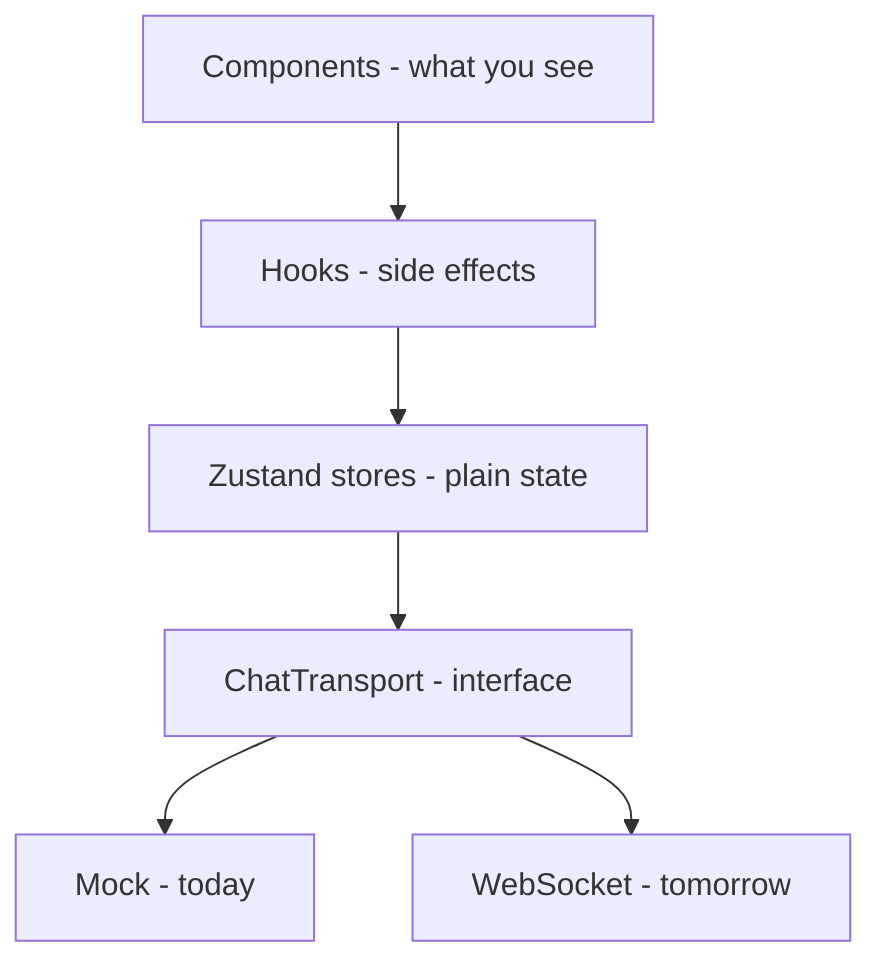
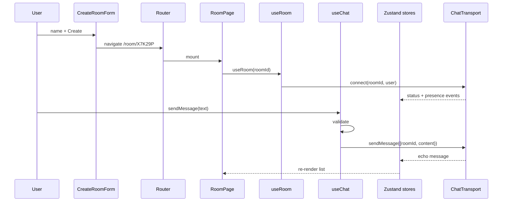

# Developer Guide — Temp Chat

For developers who maintain this project. Simple language, honest trade-offs,
links to official docs. For product overviews and file-by-file docs, see
`README.md`.

---

## 1. Project Overview

Temp Chat is a temporary chat-room app. A user creates a room (the browser
invents a 6-character code), shares a link, and people talk under temporary
names. Leaving wipes the room from the device. There are no accounts, no
server, no database, and no saved history — yet.

The word "yet" matters. The codebase is split so a real backend can be added
later without rewriting the UI:

Today `T` is the mock (one browser tab, looped-back messages). Tomorrow it is
a socket. Components, hooks, and stores do not change.

A second seam exists for calls: `MediaSession`. Today it is an honest
"unavailable" placeholder. Real WebRTC plugs in there later.

---

## 2. Architecture Overview

### Why the boundaries exist

- **Components stay dumb about the network.** If a component imported a
  socket, every UI change would risk breaking networking and testing would
  need a server. Instead components call hook callbacks.
- **Hooks own side effects.** Subscriptions, timers, clipboard, and navigation
  live in `useRoom` / `useChat` / `useMediaSession`, in one place each, with
  cleanup functions. Stores stay pure and unit-testable without jsdom.
- **Stores stay framework-free-ish.** They hold data and transitions only.
  They never import transports, routers, or DOM APIs (except the small guarded
  `sessionStorage` access in the identity store).
- **Services hide implementations.** `getChatTransport()` is the only file
  that names `MockChatTransport`. Everything else depends on the interface.

### Runtime picture

### State map

| Store                | Holds                                  | Cleared on leave |
| -------------------- | -------------------------------------- | ---------------- |
| `useIdentityStore`   | tab user `{id, displayName}`           | No (tab-scoped)  |
| `useRoomStore`       | current room, connection, error        | Yes              |
| `useChatStore`       | messages keyed by room (cap 200)       | Yes (that room)  |
| `useParticipantStore`| participants keyed by room             | Yes (that room)  |
| `useMediaStore`      | mic/cam/share/call state (local only)  | Reset            |

---

## 3. Technology Documentation

### React — what, why, how

React is a library for building user interfaces from components. We use it for
everything the user sees: pages, forms, lists, dialogs. State that is truly
local (composer draft, dialog open flags) uses `useState`; shared state uses
Zustand (see below).

- **Pros here:** huge ecosystem (Radix, Router, Testing Library), StrictMode
  catches effect bugs, React 19 + compiler-friendly patterns keep renders
  cheap.
- **Cons here:** React re-renders whole subtrees by default, so we must use
  selectors and `memo` deliberately; the toolchain (Vite plugin, lint rules)
  needs version care (see the `recommended-latest` incident in §8).
- **Alternatives:** Vue, Svelte/SvelteKit, Solid, Angular. All fine frameworks;
  React was chosen for ecosystem (Radix/shadcn, router, testing) and team
  familiarity, not because the others are bad.

### TypeScript — what, why, how

TypeScript adds static types to JavaScript. We run it **strict** (`strict`,
`noUnusedLocals`, `noUnusedParameters`, `verbatimModuleSyntax`,
`erasableSyntaxOnly`) so models, store actions, and the transport interface
are checked at build time (`npm run typecheck`, enforced inside `npm run
build`).

- **Pros here:** the `ChatTransport` seam is compile-time checked — a future
  WebSocket class that forgets `onPresence` fails the build; `import type`
  discipline keeps bundles clean.
- **Cons here:** strict flags fight some library typings (`skipLibCheck`
  mitigates); TS 6 removed `baseUrl`, so the `@/*` alias uses relative
  `paths` only.
- **Alternatives:** plain JavaScript + JSDoc. Viable for tiny apps, but the
  transport/media seams deserve real interfaces.

### Vite — what, why, how

Vite is the dev server and production bundler. `vite.config.ts` wires React,
Tailwind v4, the `@` alias, and the Vitest jsdom setup. Code-splitting is
used once, deliberately: `RoomPage` is lazy-loaded off the landing page.

- **Pros here:** instant HMR, zero-config code splitting, first-class Vitest
  integration, SPA fallback in `preview` (both `/` and `/room/X` serve 200).
- **Cons here:** dev and build use different pipelines (esbuild vs Rollup),
  so production-only issues are possible — hence `npm run build` + `preview`
  in verification.
- **Alternatives:** Next.js/Remix (server frameworks — overkill for a
  serverless frontend), Parcel, rsbuild. Vite fits a client-only SPA best.

### Tailwind CSS — what, why, how

Tailwind provides utility classes instead of hand-written CSS. We use v4
(CSS-first: `@import "tailwindcss"` plus `@theme inline` tokens in
`src/index.css`), a class-based dark variant, and shadcn-style CSS variables.
One custom utility (`.message-item` with `content-visibility`) keeps long
lists cheap.

- **Pros here:** consistent spacing/type scale, tiny custom CSS surface, dark
  mode via one class, no config file to maintain.
- **Cons here:** long class strings; variant logic needs `cva` + `cn()` to
  stay readable; developers must learn the utility vocabulary.
- **Alternatives:** CSS Modules, styled-components, MUI/Chakra (component
  libraries). Utilities won because the design is minimal and custom.

### shadcn/ui — what, why, how

shadcn/ui is not a package you install — it is a **pattern**: copy accessible
primitives (built on Radix) into `src/components/ui` and own them. That is
exactly what this repo does (`button`, `input`, `textarea`, `avatar`, `badge`,
`dialog`, `sheet`, `separator`, `tooltip`, `scroll-area`, `alert`, `sonner`
wrapper). Behavior comes from Radix (focus traps, ARIA, keyboard support);
styling comes from our Tailwind tokens via `cn()`.

- **Pros here:** accessibility without building it; full style ownership;
  per-file imports (tree-shaken); diffs live in our repo, no version-chasing.
- **Cons here:** we own the code (upstream fixes don't auto-apply); Radix
  adds dependency weight; `only-export-components` lint friction for
  co-located `cva` variants (handled in `eslint.config.js`).
- **Alternatives:** MUI, Chakra, Mantine (heavier, opinionated themes);
  Headless UI; hand-rolled primitives (a11y risk). shadcn fits "minimal,
  professional, accessible" best.

### Zustand — detailed

**What it is.** A tiny external state manager. `create<State>()(…)` makes a
store: a mutable state object plus a `set` function, with a React hook to
subscribe. Unlike Context, subscriptions are **per-selector**: `useRoomStore(s
=> s.connection)` re-renders only when `connection` changes.

**How stores work here.** Each store holds a domain slice plus its actions
(e.g. `addMessage`, `upsertParticipant`, `joinRoom`). Actions use functional
updates (`set(state => …)`) so concurrent updates compose. Cross-store
coordination (leave clears chat + participants + room) lives in hooks, not in
stores, so stores stay independently testable.

**How selectors work.** Components subscribe to the narrowest slice that works:
`useMessages(roomId)` for the list, `useParticipantCount(roomId)` (a derived
number) for the header badge, `messageCount` separate from `messages`. Shared
`EMPTY_*` constants mean "no data" never allocates a fresh array (a fresh `[]
` on every call would defeat the `Object.is` comparison and re-render
constantly).

**How it interacts with React.** The store lives outside React; the hook
returned by `create` subscribes with `useSyncExternalStore`. Reads outside
render use `store.getState()` (hooks do this for connection checks so sending
a message doesn't subscribe the composer to room state).

**Why not Context as primary global state.** Context broadcasts the whole
value to every consumer on any change — fine for theme, bad for a 200-message
list plus presence plus connection. Zustand gives O(changed-slice) updates
with less code than reducers + providers.

- **Pros here:** ~1 KB, no providers, selectors prevent render cascades,
  `getState()` for event handlers, trivially testable pure transitions.
- **Cons here:** no built-in devtools/time-travel (extension exists, unused);
  patterns are by convention (easy to write one giant store — we didn't);
  async logic needs a home (ours lives in hooks, deliberately).

**Alternatives, fairly:**

| Option | Trade-off vs Zustand here |
| ------ | ------------------------- |
| React Context + `useReducer` | Built-in, but coarse subscriptions; needs memo/split-context gymnastics for chat-scale updates. |
| Redux Toolkit | Great for large teams/event sourcing; too much boilerplate for five small slices. |
| Jotai | Atomic model is elegant; per-atom subscriptions are comparable, but the team knows store-slices better and atoms scatter related logic. |
| MobX | Transparent reactivity, minimal code; observables + decorators are a bigger conceptual shift and harder to type strictly. |
| TanStack Store | New, framework-agnostic, similar selector story; smaller ecosystem and no reason to bet on it yet. |

Zustand won on size, selector precision, and "boring technology" grounds —
not because the others are bad choices.

### Lucide React — what, why, how

The icon set (used as components: `Send`, `Share2`, `Mic`, `Video`, …,
always `aria-hidden` with adjacent text or `aria-label`). Tree-shaken named
imports keep the bundle honest.

- **Pros:** consistent stroke style, huge catalog, no emoji, accessible by
  default when labeled.
- **Cons:** another dependency; version churn in icon names.
- **Alternatives:** Heroicons, Phosphor, Tabler, inline SVG. Lucide matches
  the shadcn ecosystem (declared in `components.json`).

### React Router — what, why, how

Client-side routing for `/` and `/room/:roomId` (plus a `*` fallback to
home). `useParams` reads the code; forms `navigate()` after validation;
`leave()` navigates home after cleanup.

- **Pros:** declarative routes, deep-linkable rooms, lazy-route splitting,
  battle-tested.
- **Cons:** client routing needs server fallback rules in production hosting
  (any static host SPA fallback); v7 API moved fast — pin and read the docs.
- **Alternatives:** TanStack Router (type-safe, newer), Wouter (tiny),
  hand-rolled hash routing. React Router is the boring default and supports
  the future (loaders/actions if a backend appears).

### WebSocket — what, why future

WebSocket is a persistent bidirectional TCP-based protocol (after an HTTP
upgrade handshake) letting server and client push messages anytime — ideal for
chat fan-out. MDN documents the browser `WebSocket` API; our future client is
`src/services/chat/WebSocketChatTransport.ts` with its JSON frame protocol in
the header comment.

- **Pros for us:** low latency, server fan-out to N tabs, fits the existing
  `ChatTransport` seam exactly.
- **Cons:** needs a server to host/operate/scale (sticky sessions or shared
  pub/sub across instances), `wss` + origin checks + rate limits required.
- **Alternatives:** Server-Sent Events (server→client only — needs a second
  channel for sending), WebRTC data channels (peer-to-peer, no natural
  fan-out or history), hosted realtime (Liveblocks, Pusher, Ably, Supabase
  Realtime — faster to ship, vendor dependency + cost).

WebSocket is the strong default because the seam already assumes
"client sends, server broadcasts," but a hosted service is a legitimate
shortcut and would only change the transport implementation.

### WebRTC — what, why future

WebRTC is the browser's peer-to-peer media stack (`getUserMedia`,
`RTCPeerConnection`, data channels). It carries voice/video with low latency,
but peers must first exchange session descriptions and ICE candidates through
**signaling** (any channel — typically the same WebSocket server), use
**STUN** to discover reflexive addresses, **TURN** to relay when NATs block
peer-to-peer, and (for groups) an **SFU** so each client uploads once.

- **Pros for us:** no media server needed for 1:1, low latency, screen-share
  built in; presence flags (`isMuted`, `hasVideo`) and `CallControls` already
  exist.
- **Cons:** signaling + TURN + SFU are real infrastructure; mobile/browser
  permission UX is fiddly; group calls without an SFU melt clients.
- **Alternatives:** hosted media (LiveKit, Daily, Twilio Video, Cloudflare
  Calls) — strongly consider before self-hosting an SFU; they trade cost for
  TURN/SFU operations you don't want to run.

---

## 4. Library Decision Matrix

| Technology | Why used | Pros | Cons | Alternatives |
| ---------- | -------- | ---- | ---- | ------------ |
| React | UI | Ecosystem, components, StrictMode | Render discipline needed | Vue, Svelte, Solid |
| TypeScript | Type safety | Seams compile-checked, fewer runtime bugs | Slower setup, lib friction | JavaScript + JSDoc |
| Vite | Build/dev | Fast HMR, splitting, Vitest fit | Dev/build pipeline split | Next.js, Parcel, rsbuild |
| Tailwind v4 | Styling | Utilities, tokens, dark class | Class-string noise | CSS Modules, styled-components |
| shadcn/ui pattern | UI primitives | Owned code, Radix a11y, tree-shaken | We own updates | MUI, Chakra, Headless UI |
| Zustand | State | Selectors, tiny, testable | Convention-based | Redux, Context, Jotai, MobX |
| React Router | Routing | Deep links, lazy routes | Needs SPA fallback | TanStack Router, Wouter |
| Lucide | Icons | Consistent, labeled use | Dep churn | Heroicons, Phosphor |
| Sonner | Toasts | Tiny, accessible | One more dep | Radix toast by hand |
| Vitest + RTL | Testing | Fast, real-component tests | jsdom ≠ browser | Playwright, Cypress |
| WebSocket (future) | Realtime | Push both ways, fits seam | Server to operate | SSE, hosted realtime |
| WebRTC (future) | Media | P2P low-latency AV | Signaling/TURN/SFU ops | LiveKit, Daily |

---

## 5. Architecture Decisions

**Why Zustand?**
Decision: five focused Zustand stores with narrow selectors.
Reason: chat state updates at different rates (messages vs presence vs
connection); per-slice subscriptions keep renders proportional.
Benefits: no provider tree, tiny API, `getState()` in handlers.
Trade-offs: conventions not compiler-enforced; async lives in hooks.
Reconsider if: the team grows large enough to want action replay/debug
(Redux) or state becomes highly derived/relational.

**Why shadcn/ui pattern?**
Decision: Radix-based primitives vendored into `src/components/ui`.
Reason: accessibility out of the box with full style ownership.
Benefits: a11y (dialogs, tooltips, sheets), no theme lock-in, tree-shaken.
Trade-offs: we backport upstream fixes ourselves.
Reconsider if: the design system grows to dozens of variants needing a
maintained library (Mantine/MUI).

**Why no database?**
Decision: zero persistence — memory + tab sessionStorage only.
Reason: ephemerality *is* the product; storage adds breach surface, cost,
and moderation scope.
Benefits: nothing to leak, host, or migrate.
Trade-offs: reload loses messages; no history feature possible.
Reconsider if: users demand history — but that is a different product and
needs explicit opt-in + retention UX.

**Why no authentication?**
Decision: random tab id + self-chosen name, no passwords/OAuth/sessions.
Reason: accounts contradict "talk in 10 seconds"; there is no server to hold
sessions anyway.
Benefits: zero friction, zero credential risk.
Trade-offs: names spoofable, no identity, future server must treat every
claim as untrusted.
Reconsider if: abuse/moderation needs stable identity — then add
server-issued tokens, not frontend checks.

**Why transport abstraction?**
Decision: `ChatTransport` interface + factory; stores/hooks never name an
implementation.
Reason: the backend does not exist yet; the UI must not be rewritten when it
does.
Benefits: mock today, socket tomorrow; tests run without servers.
Trade-offs: interface design up front; slight indirection.
Reconsider if: only one transport will ever exist (unlikely — tests alone
justify it).

**Why WebRTC abstraction?**
Decision: `MediaSession` interface + unavailable placeholder + local toggle
state, disabled call buttons.
Reason: calling UI can be designed now without faking calls.
Benefits: honest UX, future implementation plugs one seam.
Trade-offs: placeholder code ships that "does nothing" (documented).
Reconsider if: we adopt a hosted media SDK — then the seam gets a real
implementation instead.

**Why temporary state?**
Decision: capped in-memory maps cleared on leave; identity in sessionStorage.
Reason: matches the product promise with minimal machinery.
Benefits: fast, private by default, no cleanup jobs.
Trade-offs: multi-tab same-browser doesn't sync (acceptable: tabs are
separate sessions).
Reconsider if: handoff across devices is required (needs server + accounts).

**Why React + Vite?**
Decision: client-only SPA, no framework server.
Reason: there is no server yet; paying for SSR complexity buys nothing.
Benefits: simple hosting (any static host), fast builds, easy tests.
Trade-offs: no SSR/SEO (irrelevant for private rooms), SPA fallback config
needed on hosts.
Reconsider if: public/SEO pages or server data fetching appear.

---

## 6. References

Primary sources only, verified while writing this guide:

- React: https://react.dev/
- TypeScript: https://www.typescriptlang.org/docs/
- Vite: https://vite.dev/
- Tailwind CSS: https://tailwindcss.com/docs
- shadcn/ui: https://ui.shadcn.com/
- Zustand: https://zustand.docs.pmnd.rs/
- Lucide: https://lucide.dev/
- React Router: https://reactrouter.com/
- Radix primitives: https://www.radix-ui.com/primitives
- Sonner: https://sonner.emilkowal.ski/
- Vitest: https://vitest.dev/
- Testing Library: https://testing-library.com/
- WebSocket (MDN): https://developer.mozilla.org/en-US/docs/Web/API/WebSocket
- WebRTC (MDN): https://developer.mozilla.org/en-US/docs/Web/API/WebRTC_API
- Vercel React best practices: https://github.com/vercel-labs/agent-skills/tree/main/skills/react-best-practices

---

## 7. Vercel Best Practices — how the skill shaped this project

The official skill (`vercel-react-best-practices` v1.0.0, fetched 2026-09-19
from the URL above, stored verbatim at
`.opencode/skills/react-best-practices/` and git-ignored) contains ~70 rules
across 8 categories. It targets React **and** Next.js; this is a Vite SPA, so
the server categories (RSC caching, `after()`, server actions) do not apply.
What was applied, with rule names:

- **Re-render optimization (the bulk of the value here):**
  `rerender-defer-reads` (selectors subscribe only to used slices;
  `getState()` in event handlers), `rerender-memo` (`ChatMessage` memoized),
  `rerender-derived-state` (`useParticipantCount`, `messageCount`),
  `rerender-derived-state-no-effect` (derived during render, no syncing
  effects), `rerender-functional-setstate` (all store updates),
  `rerender-lazy-state-init` (lazy `useState` initializers),
  `rerender-no-inline-components` (all components module-level),
  `rerender-simple-expression-in-memo` (no `useMemo` on primitives),
  `rerender-split-combined-hooks` (separate `useRoom`/`useChat`/
  `useParticipantsView`/`useMediaSession`).
- **Bundle size:** `bundle-barrel-imports` (direct imports everywhere; no
  index barrels), `bundle-dynamic-imports` (`RoomPage` via `React.lazy`),
  `bundle-analyzable-paths` (static `@/` alias, no dynamic import tricks).
- **Rendering:** `rendering-content-visibility` (`.message-item`), plus the
  capped message list so the DOM stays bounded.
- **JS performance:** `js-early-exit` (validators return fast),
  `js-set-map-lookups` (listener `Set`s, id-dedupe checks).
- **Client fetching:** `client-localstorage-schema` (versioned
  `temp-chat-identity-v1` / `temp-chat-theme` keys, try/catch for private
  mode).

Deliberately *not* applied: SWR/dedup (no fetching yet), Suspense streaming
(single fallback for the lazy route is enough), transitions/deferred values
(the update volume doesn't justify them — no premature optimization).

## 8. Environment variables & incidents worth remembering

None required. `.env.example` reserves `VITE_WS_URL` for the future
transport; the current code reads no env vars.

Two setup incidents are recorded so nobody re-learns them:

1. `npm create vite` with a Windows path scaffolded into `D:\Dtemp-chat-room`
   (path joined oddly); contents were moved to `D:\temp-chat-room` and the
   stray directory removed.
2. `eslint-plugin-react-hooks@7` ships `configs["recommended-latest"]` in
   legacy eslintrc format — flat config must use `configs.flat.recommended`.
   And TS 6 removed `baseUrl`, so the `@` alias uses relative `paths`.
